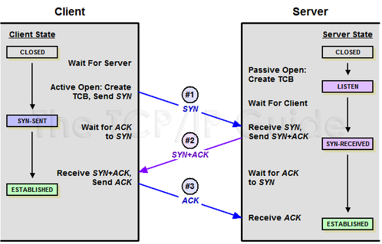

### 데이터베이스 연결
어플리케이션 서버와 데이터베이스 서버는 서로 커넥션을 맺어 데이터 전송 및 처리를 수행.  
커넥션을 맺기 위해서는 TCP 통신을 사용.   
때문에 연결 성립을 위해서는 **3-way-handshake**    
  

연결 해제를 위해서는 **4-way-handshake** 등의 과정이 필요하다.    
  
그러므로 커넥션을 맺기 위한 추가 비용이 들게 된다.

### 커넥션 풀(DBCP)
데이터베이스와의 연결을 효율적으로 관리하고 성능을 향상하기 위한 기술.    
미리 커넥션들을 생성하여 보관하고, 이를 재사용.

  
**기대 효과**
- 성능 향상: 네트워크 연결 시간을 단축시켜 응답 시간을 줄이는 데 기여.
- DB 성능 유지: DB에 대한 커넥션 개수를 일정 수준으로 제한하여 DB의 포화를 방지.

### 설정

**DBCP 관점**
- maximumPoolSize     
  커넥션 풀이 가질 수 있는 최대 커넥션 수  
  서버를 scale-out시, 주요 고려사항
  - 각 서버에 적절히 분배.

- minimumIdle  
  유휴 상태로 대기할 최소 커넥션 수  
  maximumPoolSize와 동일하게 가져가는 것이 권장 사항.  
    - idle커넥션 수 < minimumIdle인 경우, 커넥션 맺는 비용 발생 가능.

- maxLifetime  
커넥션이 풀에 반환되기 전 유지될 최대 시간
wait_timeout보다 짧게 설정 권장.
  - 커넥션이 풀에 반환되지 않고, wait_timeout이 지나면 어플리케이션은 유효하지 않은 커넥션에 요청 보낼 수 있다.

- connectionTimeout  
커넥션 풀에서 커넥션 받기 위해 대기하는 시간
사용자 고려해서 설정. 

**DB 관점**
- max_connection  
  클라이언트와 맺을 수 있는 최대 커넥션 수

- wait_timeout  
연결된 클라이언트가 작업 없이 대기할 수 있는 시간 
